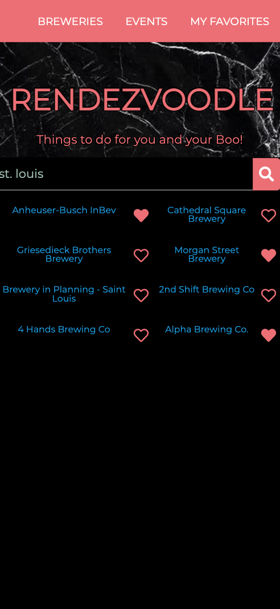

# Rendezvoodle

## Description 

Things to do for you and your Boo! A dating app for couples searching for fun "rendezvous" nearby.

Rendezvoodle uses the Open Brewery DB API and Ticketmaster API to find nearby breweries and events. It also uses Materialize for some of the CSS framework.

The user will simply need to enter a city name in the search bar, click search, and that city's listings will be displayed on the screen. If you click on the item's title, this will redirect the user to the correlated website, so that they can find all needed details for this rendezvous. When the "heart" icon is clicked, this date spot will be added to the "MY FAVORITES" tab, where your favorite dates will be saved. Using 'localStorage', the app stores any persistent data, which will save favorited dates on the display even after the screen is refreshed.

Website URL: https://anniemcfarland7.github.io/Rendezvoodle/

Repository URL: https://github.com/anniemcfarland7/Rendezvoodle

## Screenshot 

The following image shows the application's initial appearance:

